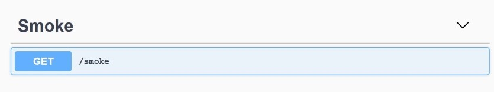
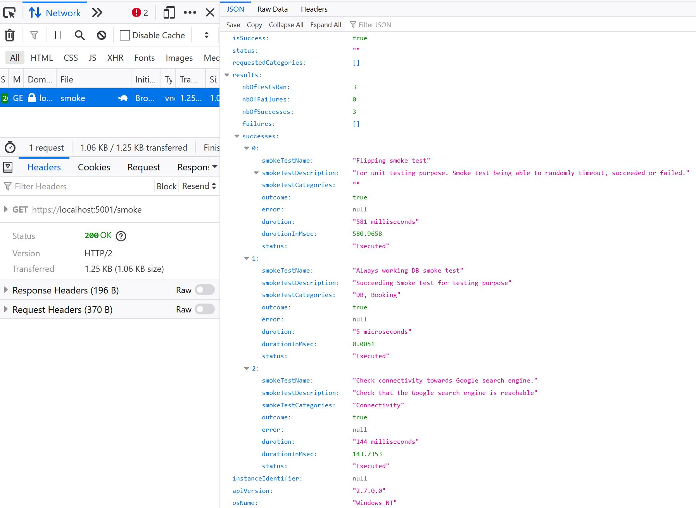
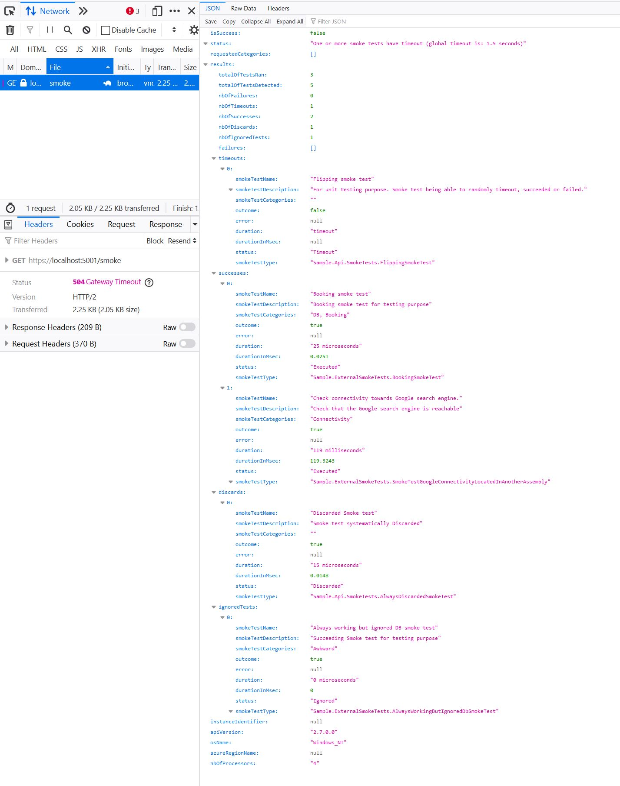
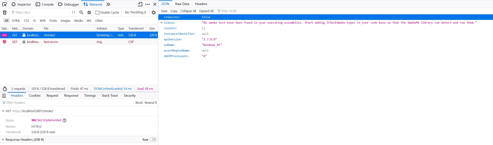
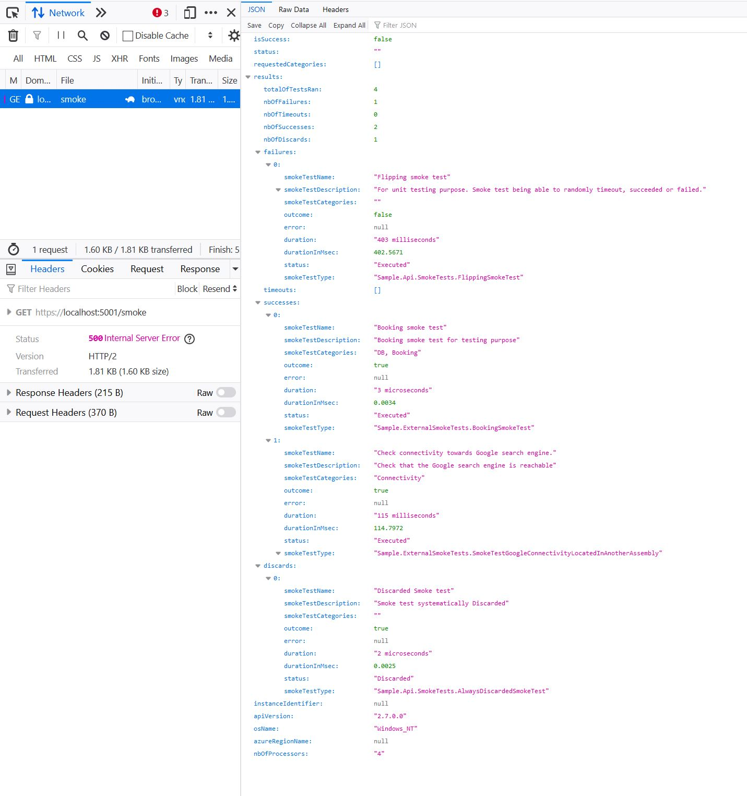
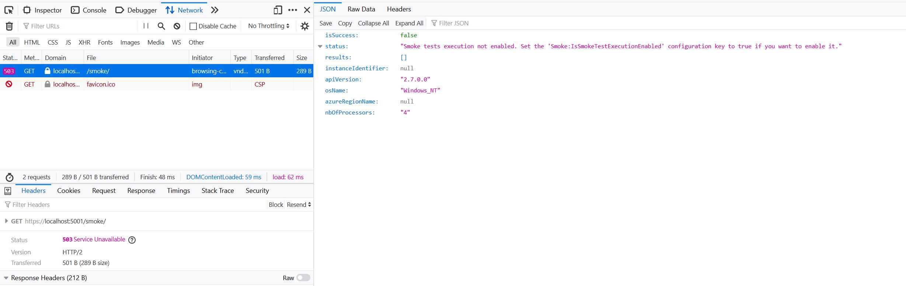

# SmokeMe! (a.k.a.  /smoke ) 

A *convention-based* dotnet solution to easily declare smoke tests and expose them behind a **/smoke** endpoint in your API.


> **Upgrading from v2?** See the [Migration Guide (v2 to v3)](./MIGRATION-v2-to-v3.md) for breaking changes and step-by-step instructions.

> **v3 is now split into 2 NuGet packages:** `SmokeMe` (core, netstandard2.0) and `SmokeMe.AspNetCore` (net8.0 / net9.0). See [Packages](#packages) for details.

#
 [use case driven on Bluesky](https://bsky.app/profile/tpierrain.bsky.social) - (thomas.pierrain@shodo.io)


## Smoke tests anyone?
Smoke test is preliminary integration testing to reveal simple failures severe enough to, for example, reject a prospective software release.

The expression came from plumbing where a *smoke test* is a technique forcing non-toxic, artificially created smoke through waste and drain pipes under a slight pressure **to find leaks**. In software, we use *smoke tests* in order **to find basic issues in production**.



This may differ from classical health checks:

 - **health checks** are sub-second requests made by Load balancers or infrastructure components to your APIs
    - You often just check connectivity with external dependency systems

 - **smoke checks** are (*sub-ten of seconds*) integration tests made by you or your CI scripts just after a deployment
    - You often check *"high-value uses"* of your API to see if it is globally OK
    - This can take more time than a classical health check
    - Note: you can also use them in order to monitor your API overall health


### *"Smoke tests can save your bacon when doing Continuous Delivery!"*

The idea of the **SmokeMe** library is to save you time and let you only focus on writing your functional or technical smoke tests.

All the auto-discovery, infrastructure and plumbing things are done for you by the library.


## Packages

SmokeMe v3 is split into two NuGet packages:

| Package | Target | Purpose |
|---------|--------|---------|
| **SmokeMe** | netstandard2.0 | Core library — smoke test base class, discovery, execution. No ASP.NET dependency. |
| **SmokeMe.AspNetCore** | net8.0 / net9.0 | ASP.NET Core integration — `AddSmokeMe()` + `MapSmokeEndpoint()` |

If you have smoke tests in a **separate class library**, that project only needs the `SmokeMe` package. Only your **web host** project needs `SmokeMe.AspNetCore`.


## It couldn't be easier!

### A. Setup your API

1. Add both NuGet packages to your API project:

```xml
<PackageReference Include="SmokeMe" Version="3.1.0" />
<PackageReference Include="SmokeMe.AspNetCore" Version="3.1.0" />
```

2. Register and map the smoke endpoint in your `Program.cs`:

```csharp
using SmokeMe.AspNetCore;

var builder = WebApplication.CreateBuilder(args);

builder.Services.AddSmokeMe(); // registers smoke test discovery + configuration

var app = builder.Build();

app.MapSmokeEndpoint(); // GET /smoke (default path, customizable)

app.Run();
```

That's it. SmokeMe will automatically discover all `SmokeTest` classes across your loaded assemblies and run them when you hit `/smoke`.

### B. Write your smoke tests

A smoke test scenario **is just a class deriving from the `SmokeTest` abstract class** with 3 abstract members to override and a few optional virtual methods (like `HasToBeDiscarded()` if you want to couple a smoke test to a feature toggle, or `CleanUp()` if you need to remove production data created during the test).

All the dependencies you need will be automatically injected via constructor injection from your ASP.NET `IServiceProvider`.

```csharp

/// <summary>
/// Smoke test/scenario/code to be executed in order to check that a minimum
/// viable capability of your system is working.
///
/// Note: all the services and dependencies you need for it will be automatically
/// injected by the SmokeMe framework via the ASP.NET IServiceProvider of your API
/// (classical constructor-based injection). Can't be that easy, right? ;-)
/// </summary>

[Category("Connectivity")]
public class SmokeTestGoogleConnectivityLocatedInAnotherAssembly : SmokeTest
{
    private readonly IRestClient _restClient;

    public override string SmokeTestName => "Check connectivity with Google";
    public override string Description => "Check that the Google search engine is reachable from our API";

    public SmokeTestGoogleConnectivityLocatedInAnotherAssembly(IRestClient restClient)
    {
        // SmokeMe! will inject you any dependency you need (and already registered in your ASP.NET API IoC)
        // (here, we receive an instance of a IRestClient)
        _restClient = restClient;
    }

    public override async Task<SmokeTestResult> Scenario()
    {
        // check if Google is still here ;-)
        var response = await _restClient.GetAsync("https://www.google.com/");

        if (response.StatusCode == HttpStatusCode.OK)
        {
            return new SmokeTestResult(true);
        }

        return new SmokeTestResult(false);
    }
}

```

You can add one or more SmokeMe attributes such as:

__Ignore__

```csharp

    [Ignore]
    public class SmokeTestDoingStuffs : SmokeTest
    {
        // smoke test code here
    }

```

or __Category__ to target one or more subsets of smoke tests.

```csharp

    [Category("Booking")]
    [Category("Critical")]
    public class AnotherSmokeTestDoingStuffs : SmokeTest
    {
        // smoke test code here
    }

```


### C. While deploying or supporting your production

You just GET the **/smoke** endpoint **at the root level of your API**.

e.g.:

## https://(your-own-api-url):(portnumber)/smoke

or via curl for instance:

```

curl -X GET "https://localhost:5001/smoke" -H  "accept: */*"

```

And you check the HTTP response type you get:

### HTTP 200 (OK)

Means that all your smoke tests have been executed successfully and before the global timeout.




### HTTP 504 (GatewayTimeout)

Means that one or more smoke tests have timed out (configurable global timeout is 30 seconds by default).




### HTTP 501 (Not implemented)

Means that **SmokeMe** could not find any `SmokeTest` type within all the assemblies
that have been loaded into the execution context of this API.




### HTTP 500 (Internal Server Error)

Means that **SmokeMe** has executed all your declared `SmokeTest` instances but there has been
at least one failing smoke test.




### HTTP 503 (Service Unavailable)

Means that smoke test execution has been disabled via configuration.




---

## Configuration

SmokeMe reads its configuration from your `appsettings.json` under the `Smoke:` section:

```json
{
  "Smoke": {
    "GlobalTimeoutInMsec": 30000,
    "IsSmokeTestExecutionEnabled": true
  }
}
```

You can also configure programmatically:

```csharp
builder.Services.AddSmokeMe(options =>
{
    options.GlobalTimeout = TimeSpan.FromSeconds(60);
    options.IsExecutionEnabled = true;
});
```

`appsettings.json` values take precedence over programmatic defaults when both are present.

---

## FAQ

### 1. Does SmokeMe execute all smoke tests in parallel?

Yes. Every smoke test runs in a dedicated TPL Task.

### 2. Does SmokeMe have a global timeout?

Yes. It's 30 seconds by default. You can override this value by setting the `Smoke:GlobalTimeoutInMsec` configuration key in your `appsettings.json` or via `AddSmokeMe(options => ...)`.

### 3. How does SmokeMe find my smoke tests?

SmokeMe scans all loaded assemblies for types deriving from `SmokeTest`. As long as the assembly containing your smoke tests is loaded (referenced by your API project), they will be discovered automatically.

### 4. How to code and declare a smoke test?

Implement a class deriving from `SmokeMe.SmokeTest`:

```csharp

/// <summary>
/// Smoke test to check that room availabilities works and is accessible.
/// </summary>
public class AvailabilitiesSmokeTest : SmokeTest
{
    private readonly IAvailabilityService _availabilityService;

    public override string SmokeTestName => "Check Availabilities";
    public override string Description
        => "TBD: will check something like checking that one can find some availabilities around Marseille city next month.";

    /// <summary>
    /// Instantiates a <see cref="AvailabilitiesSmokeTest"/>
    /// </summary>
    /// <param name="availabilityService">The <see cref="IAvailabilityService"/> we need (will be
    /// automatically injected par the SmokeMe library)</param>
    public AvailabilitiesSmokeTest(IAvailabilityService availabilityService)
    {
        // availability service here is just an example of
        // on of your own API-level registered service automatically
        // injected to your smoke test instance by the SmokeMe lib
        _availabilityService = availabilityService;
    }

    /// <summary>
    /// The implementation of this smoke test scenario.
    /// </summary>
    /// <returns>The result of the Smoke test.</returns>
    public override Task<SmokeTestResult> Scenario()
    {
        if (_availabilityService != null)
        {
            // TODO: implement our smoke test here
            // (the one using the _availabilityService to check hotels' rooms availability)
            return Task.FromResult(new SmokeTestResult(true));
        }

        return Task.FromResult(new SmokeTestResult(false));
    }
}

```

### 5. How can I disable the execution of all smoke tests?

Set `Smoke:IsSmokeTestExecutionEnabled` to `false` in your configuration:

```json
{
  "Smoke": {
    "GlobalTimeoutInMsec": 1500,
    "IsSmokeTestExecutionEnabled": false
  }
}
```

The `/smoke` endpoint will return HTTP 503 (Service Unavailable).

### 6. How can I run a subset of my smoke tests only?

All you have to do is:

1. To declare some [Category("myCategoryName")] attributes on the SmokeTest types you want. For instance:

```csharp

    [Category("DB")]
    [Category("Booking")]
    public class BookADoubleRoomSmokeTest : SmokeTest
    {
        // smoke test code here
    }

```

2. To call the /smoke HTTP route with the category you want to run specifically as Querystring.

E.g.:

```
<your-api>/smoke?categories=Booking

```

or if you want to call all smoke tests corresponding to many categories only (assuming here you want to run only smoke tests having either "Booking", "Critical" or "Payment" category associated):

```

<your-api>/smoke?categories=Booking&categories=Critical&categories=Payment

```

### 7. How can I Ignore one or more smoke tests?

Just add an [Ignore] attribute on the smoke tests you want to Ignore.
e.g.:

```csharp

    [Ignore]
    public class SmokeTestDoingStuffs : SmokeTest
    {
        // smoke test code here
    }

```

### 8. How can I discard the execution of a smoke tests depending on one of our feature flags?

A Discarded Smoke test is a smoke test that exist but won't be run on purpose.

This can be very handy when you want to execute a smoke test for a v next feature of your own, but only when the feature will be toggled/enabled.

To make it happen, just override the HasToBeDiscarded() virtual method of the SmokeTest type and use your own feature toggling mechanism in it to decided whether to Discard this test at runtime or not.

e.g.:

```csharp

    public class FeatureToggledSmokeTest : SmokeTest
    {
        private readonly IToggleFeatures _featureToggles;

        public FeatureToggledSmokeTest(IToggleFeatures featureToggles)
        {
            _featureToggles = featureToggles;
        }

        public override Task<bool> HasToBeDiscarded()
        {
            return Task.FromResult(!_featureToggles.IsEnabled("featureToggledSmokeTest"));
        }

        public override string SmokeTestName => "Dummy but feature toggled smoke test";
        public override string Description => "A smoke test in order to show how to Discard or not based on your own feature toggle system";

        public override Task<SmokeTestResult> Scenario()
        {
            return Task.FromResult(new SmokeTestResult(true));
        }
    }

```


### 9. What is the difference between Ignored and Discarded smoke tests?

An **Ignored** smoke test is a smoke test that won't run until you remove its `[Ignore]` attribute (compile-time decision).

A **Discarded** smoke test is a smoke test that can be run (or not) depending on dynamic conditions at runtime (very handy if you want some smoke tests to be enabled with a given n+1 version or any feature toggle for instance).


### 10. How can I clean up production data created during a smoke test?

Some smoke tests need to create real data in production (e.g. a booking, a user account) to verify that the system works. You don't want this data to remain after the test.

Override the `CleanUp()` virtual method:

```csharp

public class BookingRoundTripSmokeTest : SmokeTest
{
    private readonly IBookingService _bookingService;
    private string _createdBookingId;

    public override string SmokeTestName => "Booking round-trip";
    public override string Description => "Creates a booking and verifies it can be retrieved, then deletes it.";

    public BookingRoundTripSmokeTest(IBookingService bookingService)
    {
        _bookingService = bookingService;
    }

    public override async Task<SmokeTestResult> Scenario()
    {
        _createdBookingId = await _bookingService.CreateTestBookingAsync();
        var booking = await _bookingService.GetBookingAsync(_createdBookingId);

        return new SmokeTestResult(booking != null);
    }

    public override async Task CleanUp()
    {
        if (_createdBookingId != null)
        {
            await _bookingService.DeleteBookingAsync(_createdBookingId);
        }
    }
}

```

**Key behaviors:**
- `CleanUp()` runs **after `Scenario()`**, whether `Scenario()` succeeded or failed
- If `CleanUp()` throws, the **test outcome is NOT affected** — the error is reported separately in a `CleanupError` field in the JSON response
- `CleanUp()` is **NOT called** when the test is discarded (via `HasToBeDiscarded()`)
- `CleanUp()` time is included in the total test duration


### 11. How can I protect the /smoke endpoint with authorization?

Since v3, `MapSmokeEndpoint()` returns an `IEndpointConventionBuilder`, which means you can chain any standard ASP.NET Core endpoint configuration — including authorization:

```csharp

// Require any authenticated user
app.MapSmokeEndpoint().RequireAuthorization();

// Require a specific policy
app.MapSmokeEndpoint().RequireAuthorization("AdminOnly");

// Require a specific role
app.MapSmokeEndpoint().RequireAuthorization(policy =>
    policy.RequireRole("Ops", "Admin"));

```

This works exactly like any other Minimal API endpoint. No SmokeMe-specific configuration needed.


---

## Next steps

 - **Security:** with a nice way for you to plug your own ACL and rights mechanism to the /smoke resource (so that not everyone is able to execute your smoke tests in production)
 - Some tooling so that I can easily reuse/run all my smoke tests in classical acceptance testing sessions (see project: https://github.com/tpierrain/SmokeMe.TestAdapter)
 - A way to easily declare that you want to prevent 2 or more smoke tests to be ran in // if needed (something like a [Mutex("idOfIDoNotWantToHaveMoreOfThoseSmokeTestsToBeRanInParallel")] attribute for some of our Smoke tests)
 - Some *maximum number of smoke tests to be run in parallel* optional and configurable limitation mechanism

 More on this [here](./Backlog.md) and on the issues.


---

## Hope you will enjoy it!

We value your input and appreciate your feedback. Thus, don't hesitate to leave them on the [**github issues of the project**](https://github.com/tpierrain/SmokeMe/issues).
